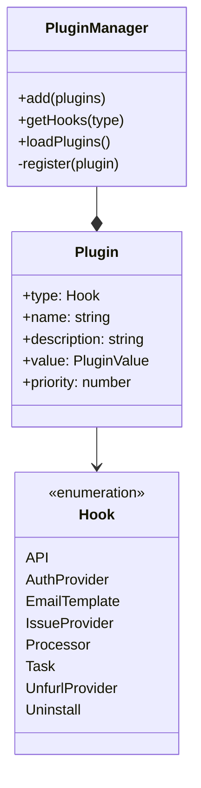

# Plugin Development Guide

This guide explains how to create plugins for Outline. Plugins allow you to extend Outline's functionality through various hook types and integration points.

## Table of Contents

1. [Quick Start Guide](#quick-start-guide)
2. [Plugin System Overview](#plugin-system-overview)
3. [Plugin Types and Examples](#plugin-types-and-examples)
4. [Creating a Plugin](#creating-a-plugin)
5. [Testing and Debugging](#testing-and-debugging)
6. [Best Practices](#best-practices)
7. [Deployment and Release](#deployment-and-release)

## Quick Start Guide

Get your first plugin up and running quickly:

### 1. Create Plugin Structure
```bash
# Create plugin directory
mkdir -p plugins/my-first-plugin/{client,server}

# Create basic files
touch plugins/my-first-plugin/plugin.json
touch plugins/my-first-plugin/server/index.ts
touch plugins/my-first-plugin/client/index.tsx
```

### 2. Configure Plugin
```json
// plugins/my-first-plugin/plugin.json
{
  "id": "my-first-plugin",
  "name": "My First Plugin",
  "description": "A sample plugin to demonstrate plugin development",
  "priority": 100
}
```

### 3. Implement Basic Hook
```typescript
// plugins/my-first-plugin/server/index.ts
import { PluginManager, Hook } from "@server/utils/PluginManager";
import Router from "koa-router";
import config from "../plugin.json";

// Create a simple API endpoint
const router = new Router();
router.get("status", ctx => {
  ctx.body = {
    status: "ok",
    message: "Plugin is working!"
  };
});

// Register plugin with API hook
PluginManager.add({
  ...config,
  type: Hook.API,
  value: router
});
```

### 4. Build and Test
```bash
# Install dependencies
yarn install

# Build plugin
yarn build

# Run tests
yarn test plugins/my-first-plugin
```

### 5. Next Steps
- Explore [Plugin Types and Examples](#plugin-types-and-examples)
- Add authentication using [Authentication Provider](#1-authentication-provider)
- Implement additional hooks like [Task Processor](#3-task-processor)
- Follow [Best Practices](#best-practices) for production-ready code

## Plugin System Overview



## Plugin Types and Examples

### 1. Authentication Provider

Authentication providers allow integration with external authentication systems. Here's an example from the Google authentication plugin:

```typescript
// plugins/google/server/auth/google.ts

export default class GoogleAuthProvider {
  // Configuration
  const scopes = [
    "https://www.googleapis.com/auth/userinfo.profile",
    "https://www.googleapis.com/auth/userinfo.email",
  ];

  // Plugin registration
  passport.use(
    new GoogleStrategy(
      {
        clientID: env.GOOGLE_CLIENT_ID,
        clientSecret: env.GOOGLE_CLIENT_SECRET,
        callbackURL: `${env.URL}/auth/${config.id}.callback`,
        passReqToCallback: true,
        scope: scopes,
      },
      async function (ctx, accessToken, refreshToken, params, profile, done) {
        // Authentication logic
      }
    )
  );
}
```

Key points:
- Define required scopes
- Configure authentication strategy
- Handle user profile data
- Manage tokens and sessions

### 2. API Hook

API hooks allow plugins to add new API endpoints. Example from the Slack plugin:

```typescript
// plugins/slack/server/api/hooks.ts
const router = new Router();

// Hook for URL unfurling
router.post(
  "hooks.unfurl",
  validate(T.HooksUnfurlSchema),
  async (ctx: APIContext<T.HooksUnfurlReq>) => {
    const { token, team_id, event } = ctx.input.body;
    
    // Verify request
    verifySlackToken(token);
    
    // Find user
    const user = await findUserForRequest(team_id, event.user);
    
    // Process URLs and create unfurls
    const unfurls = {};
    for (const link of event.links) {
      // Generate preview content
      unfurls[link.url] = {
        title: doc.title,
        text: doc.getSummary(),
        color: doc.collection?.color
      };
    }
    
    // Send response
    await Slack.post("chat.unfurl", {
      token: auth.token,
      channel: event.channel,
      unfurls,
    });
  }
);
```

Key points:
- Define routes with validation
- Handle authentication/authorization
- Process incoming webhook data
- Integrate with external services
- Return appropriate responses

### 3. Task Processor

Task processors handle background operations. Example from the Webhook processor:

```typescript
// plugins/webhooks/server/processors/WebhookProcessor.ts

export default class WebhookProcessor extends BaseProcessor {
  static applicableEvents: ["*"] = ["*"];

  async perform(event: Event) {
    // Find relevant webhook subscriptions
    const webhookSubscriptions = await WebhookSubscription.findAll({
      where: {
        enabled: true,
        teamId: event.teamId,
      },
    });

    // Filter and process subscriptions
    const applicableSubscriptions = webhookSubscriptions.filter((webhook) =>
      webhook.validForEvent(event)
    );

    // Schedule delivery tasks
    await Promise.all(
      applicableSubscriptions.map((subscription) =>
        new DeliverWebhookTask().schedule({
          event,
          subscriptionId: subscription.id,
        })
      )
    );
  }
}
```

Key points:
- Define applicable events
- Implement perform() method
- Handle errors gracefully
- Schedule follow-up tasks as needed

### 4. URL Unfurling

URL unfurling plugins provide rich previews for external links. Example from GitHub:

```typescript
// plugins/github/server/github.ts

export class GitHub {
  public static unfurl: UnfurlSignature = async (url: string, actor: User) => {
    // Parse and validate URL
    const resource = GitHub.parseUrl(url);
    if (!resource) {
      return;
    }

    // Check integration exists
    const integration = await Integration.findOne({
      where: {
        service: IntegrationService.GitHub,
        teamId: actor.teamId,
        "settings.github.installation.account.name": resource.owner,
      },
    });

    try {
      // Authenticate and fetch data
      const client = await GitHub.authenticateAsInstallation(
        integration.settings.github!.installation.id
      );
      const res = await client.requestResource(resource);
      
      // Transform and return data
      return GitHub.transformData(res.data, resource.type);
    } catch (err) {
      return { error: err.message || "Unknown error" };
    }
  };
}
```

Key points:
- URL parsing and validation
- Authentication handling
- Data transformation
- Error handling

### 5. Issue Provider

Issue providers allow integration with external issue tracking systems. Example from GitHub:

```typescript
// plugins/github/server/GitHubIssueProvider.ts
export class GitHubIssueProvider extends BaseIssueProvider {
  constructor() {
    super(IntegrationService.GitHub);
  }

  async fetchSources(integration: Integration): Promise<IssueSource[]> {
    // Authenticate with GitHub
    const client = await GitHub.authenticateAsInstallation(
      integration.settings.github!.installation.id
    );

    const sources: IssueSource[] = [];

    // Fetch repositories as issue sources
    for await (const response of client.requestRepos()) {
      const repos = response.data;
      sources.push(
        ...repos.map((repo) => ({
          id: String(repo.id),
          name: repo.name,
          owner: { id: String(repo.owner.id), name: repo.owner.login },
          service: IntegrationService.GitHub,
        }))
      );
    }

    return sources;
  }
}
```

Key points:
- Extend BaseIssueProvider
- Implement required methods (fetchSources)
- Handle authentication with external service
- Transform external data to internal format
- Support pagination when needed

## Creating a Plugin

1. **Basic Structure**
```
plugins/your-plugin/
├── plugin.json         # Plugin metadata
├── client/            # Frontend code
│   ├── index.tsx
│   └── components/
└── server/            # Backend code
    ├── index.ts
    ├── env.ts         # Environment variables
    └── api/           # API routes
```

2. **Plugin Metadata (plugin.json)**
```json
{
  "id": "your-plugin",
  "name": "Your Plugin",
  "description": "Description of your plugin",
  "priority": 10
}
```

3. **Plugin Registration**
```typescript
// server/index.ts
import { PluginManager, Hook } from "@server/utils/PluginManager";
import config from "../plugin.json";

PluginManager.add({
  ...config,
  type: Hook.YourHookType,
  value: YourImplementation,
});
```

## Testing and Debugging

1. **Unit Testing**
```typescript
describe("YourPlugin", () => {
  it("should handle expected input", async () => {
    const result = await YourPlugin.process(input);
    expect(result).toBeDefined();
  });

  it("should handle errors gracefully", async () => {
    const result = await YourPlugin.process(invalidInput);
    expect(result.error).toBeDefined();
  });
});
```

2. **Common Issues**
- Environment variables not set
- Missing authentication credentials
- Incorrect hook type
- Priority conflicts with other plugins

3. **Debugging Tips**
- Use Logger.debug for development insights
- Check plugin initialization in PluginManager
- Verify hook registration
- Monitor event processing

## Best Practices

1. **Error Handling**
- Always catch and log errors
- Provide meaningful error messages
- Fail gracefully when possible

2. **Performance**
- Use caching when appropriate
- Implement rate limiting
- Handle async operations properly

3. **Security**
- Validate all inputs
- Handle authentication carefully
- Follow principle of least privilege

4. **Maintenance**
- Document your code
- Follow TypeScript best practices
- Keep dependencies updated

## Deployment and Release

### 1. Building and Testing

```bash
# Install dependencies
yarn install

# Build plugin
yarn build

# Run plugin tests
yarn test plugins/your-plugin

# Run integration tests
yarn test:integration
```

### 2. Version Management

1. **Versioning**
   - Follow semantic versioning (MAJOR.MINOR.PATCH)
   - Update version in both:
     ```json
     // plugin.json
     {
       "version": "1.0.0"
     }
     ```

2. **Changelog**
   Create/update CHANGELOG.md:
   ```markdown
   # Changelog

   ## [1.0.0] - 2025-05-15
   ### Added
   - Initial release
   - Feature A implementation
   - Integration with service B

   ### Changed
   - Updated API endpoints
   - Improved error handling
   ```

### 3. Environment Setup

1. **Configuration**
   ```typescript
   // plugins/your-plugin/server/env.ts
   export default {
     PLUGIN_API_KEY: process.env.PLUGIN_API_KEY,
     PLUGIN_API_URL: process.env.PLUGIN_API_URL,
     PLUGIN_TIMEOUT: process.env.PLUGIN_TIMEOUT || "5000",
   };
   ```

2. **Documentation**
   Add to .env-prod-sample:
   ```
   # YourPlugin Configuration
   PLUGIN_API_KEY=your_api_key
   PLUGIN_API_URL=https://api.service.com
   PLUGIN_TIMEOUT=5000
   ```

### 4. Docker Deployment

1. **Update Dockerfile**
   ```dockerfile
   # Include plugin files
   COPY plugins/your-plugin /outline/plugins/your-plugin

   # Install plugin dependencies
   RUN yarn workspace your-plugin install
   ```

2. **Docker Compose Configuration**
   ```yaml
   services:
     app:
       build:
         context: .
         args:
           - PLUGIN_API_KEY=${PLUGIN_API_KEY}
       environment:
         - PLUGIN_API_URL=${PLUGIN_API_URL}
   ```

### 5. Release Checklist

1. **Pre-release**
   - [ ] All tests passing
   - [ ] Dependencies updated
   - [ ] Environment variables documented
   - [ ] Breaking changes noted
   - [ ] API documentation updated
   - [ ] Performance impact assessed

2. **Deployment Steps**
   ```bash
   # Build and tag release
   git tag v1.0.0
   docker build -t your-plugin:1.0.0 .

   # Deploy to staging
   docker push your-plugin:1.0.0-staging
   
   # Deploy to production
   docker push your-plugin:1.0.0
   ```

3. **Post-deployment**
   - Monitor error rates
   - Check integration status
   - Verify data consistency
   - Watch performance metrics

### 6. Rollback Procedures

1. **Quick Rollback**
   ```bash
   # Revert to previous version
   git checkout v0.9.0
   yarn build
   docker compose up -d
   ```

2. **Recovery Steps**
   - Identify issue cause
   - Switch to last stable version
   - Restore data if needed
   - Update status page
   - Document incident

3. **Communication**
   - Notify affected users
   - Update status page
   - Document lessons learned